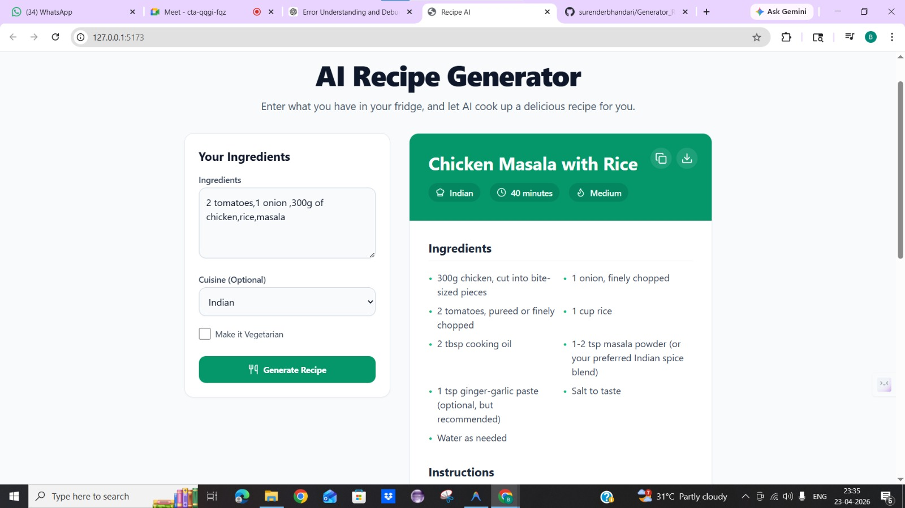
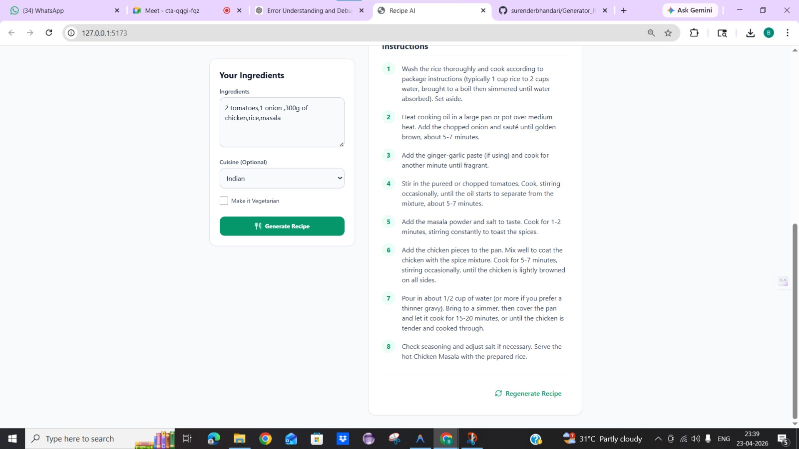

# AI Recipe Generator

A full-stack application that generates cooking recipes from a list of ingredients using Google's Gemini AI.

## Screenshots
<div align="center">
  
  &nbsp;
  
</div>
## Tech Stack
- **Frontend**: React (Vite), Tailwind CSS, Lucide React
- **Backend**: Python (FastAPI)
- **AI**: Google Gemini API (`gemini-1.5-flash`)

## Folder Structure
```
recipe-ai-app/
├── backend/
│   ├── .env.example
│   ├── requirements.txt
│   ├── main.py
│   ├── ai_service.py
│   └── prompt_builder.py
└── frontend/
    ├── package.json
    ├── vite.config.js
    ├── tailwind.config.js
    ├── index.html
    └── src/
        ├── main.jsx
        ├── App.jsx
        ├── index.css
        └── components/
            ├── InputForm.jsx
            └── RecipeCard.jsx
```

## Setup Instructions

### 1. Backend Setup
1. Open a terminal and navigate to the `backend` directory:
   ```bash
   cd backend
   ```
2. Create a virtual environment (optional but recommended):
   ```bash
   python -m venv venv
   # On Mac/Linux:
   source venv/bin/activate 
   
   # On Windows (PowerShell):
   # If you get an UnauthorizedAccess error, run this first:
   # Set-ExecutionPolicy Unrestricted -Scope Process
   .\venv\Scripts\activate
   ```
3. Install dependencies:
   ```bash
   pip install -r requirements.txt
   ```
4. Configure your environment variables:
   - Copy `.env.example` to `.env`
   - Add your Google Gemini API key:
     ```env
     GEMINI_API_KEY=your_actual_api_key_here
     ```
5. Start the backend server:
   ```bash
   uvicorn main:app --reload
   ```
   The backend will be running at `http://localhost:8000`.

### 2. Frontend Setup
1. Open a new terminal and navigate to the `frontend` directory:
   ```bash
   cd frontend
   ```
2. Install dependencies:
   ```bash
   npm install
   ```
3. Start the development server:
   ```bash
   npm run dev
   ```
   The frontend will be accessible at `http://localhost:5173`.

## Features
- **AI-Powered Recipes**: Provide a list of ingredients, select your preferred cuisine, and toggle the vegetarian option to receive a fully structured recipe.
- **Dynamic Frontend**: Modern and clean UI with Tailwind CSS. Includes loading states, error handling, and a styled recipe card.
- **Save Locally**: Save your favorite generated recipes locally on your device using localStorage.
- **Copy to Clipboard**: Easily copy the generated recipe in a formatted string.
- **Regenerate Option**: Try again with a single click if you want a different recipe using the same ingredients.
